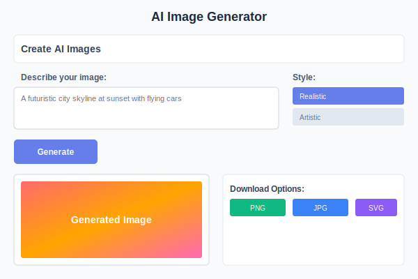

# AI Image Generator

Create stunning visuals, artwork, and graphics with our advanced AI image generation technology.

## What Can You Create?

- 🎨 **Digital Art** - Original artwork in any style
- 📸 **Photography-style Images** - Realistic photos for any purpose
- 🎭 **Illustrations** - Custom illustrations for blogs, websites, and marketing
- 🏢 **Business Graphics** - Professional visuals for presentations and reports
- 🎪 **Creative Concepts** - Unique visuals for creative projects

## How to Generate Images

### 1. Describe Your Image
Write a clear, detailed description of what you want to see:
- **Subject**: What's the main focus of the image?
- **Style**: Realistic, artistic, cartoon, vintage, etc.
- **Colors**: Specific color schemes or preferences
- **Composition**: How elements should be arranged
- **Mood**: The feeling or atmosphere you want

### 2. Choose Style Options
Select from various style presets:
- **Realistic** - Photo-like quality
- **Artistic** - Painterly and creative styles  
- **Digital Art** - Modern digital illustration
- **Vintage** - Retro and classic aesthetics
- **Minimalist** - Clean and simple designs

### 3. Generate and Download
- Click "Generate Image" to create your visual
- Review the result and regenerate if needed
- Download in your preferred format (PNG, JPG, SVG)

## Available AI Models

The AI Image Generator offers multiple state-of-the-art models, each with unique strengths:

### DALL-E 3
- **Best for**: Prompt accuracy and understanding complex descriptions
- **Style**: Versatile, handles text in images well
- **Resolution**: 1024x1024, 1024x1792, 1792x1024
- **Quality Options**: Standard and HD

### GPT-Image-1
- **Best for**: Photo-realistic images with precise control
- **Style**: Highly detailed, realistic outputs
- **Resolution**: 1024x1024, 1024x1792, 1792x1024
- **Features**: Advanced prompt understanding

### Flux Pro
- **Best for**: High-quality artistic and creative images
- **Style**: Balanced between artistic and realistic
- **Features**: Fast generation, consistent quality

### Flux Pro Kontext
- **Best for**: Image generation with contextual understanding
- **Style**: Advanced composition and scene understanding  
- **Use Cases**: 
  - **Text-to-Image**: Generate images from descriptions
  - **Image-to-Image**: Transform existing images
  - **Multi-Image**: Work with multiple reference images
- **Features**: Superior contextual awareness for complex scenes

### Ideogram
- **Best for**: Text rendering within images
- **Style**: Excellent for logos, posters, and designs with text
- **Features**: Best-in-class text generation in images

### Midjourney
- **Best for**: Artistic and creative visuals
- **Style**: Signature artistic aesthetic
- **Features**: Community-trained model with unique style

### Nano Banana / Nano Banana Pro
- **Best for**: Fast, efficient generation
- **Style**: Versatile general-purpose models
- **Pro Version**: Enhanced quality and detail

### Seedream v4
- **Best for**: High-detail fantasy and creative art
- **Style**: Vibrant, detailed artistic outputs
- **Features**: Excellent for concept art and illustrations

> **💡 Model Selection Tip**
>
> - Use **DALL-E 3** for accurate prompt interpretation
> - Choose **Flux Pro Kontext** for contextual scene generation
> - Pick **Ideogram** when text is important in the image
> - Select **Midjourney** for distinctive artistic style
> - Try **GPT-Image-1** for photorealism

## Best Practices for Prompts

> **🎨 Creating Better Images**
>
> - Use descriptive, visual language
> - Specify styles, colors, and composition
> - Include lighting and mood details
> - Mention specific artistic techniques or references

### Example Prompts

**Basic**: "A sunset over mountains"

**Better**: "A dramatic sunset over snow-capped mountains, with golden and orange clouds reflecting on a calm lake, photography style with warm lighting"

**Best**: "A dramatic sunset over snow-capped mountains in the style of Ansel Adams, with golden and orange clouds reflecting on a perfectly calm lake, black and white photography with high contrast and sharp detail, wide-angle landscape composition"

## Image Styles Available

### Realistic Styles
- **Photography** - Lifelike photos
- **Portrait** - Human subjects  
- **Landscape** - Natural scenes
- **Product** - Commercial photography

### Artistic Styles
- **Oil Painting** - Classic painted look
- **Watercolor** - Soft, flowing style
- **Digital Art** - Modern illustration
- **Abstract** - Non-representational art

### Specialized Styles
- **Logo Design** - Business branding
- **Cartoon** - Fun, animated style
- **Technical** - Diagrams and illustrations
- **Vintage** - Retro and classic looks

## Download Options

All generated images can be downloaded in multiple formats:

- **PNG** - High quality with transparency support
- **JPG** - Compressed format for web use
- **SVG** - Vector format for scalable graphics (when applicable)

## Tips for Success

**For Marketing Materials:**
- Specify brand colors and style preferences
- Include composition details (horizontal/vertical)
- Mention intended use (social media, print, web)

**For Artwork:**
- Reference specific artists or art movements
- Describe lighting and atmosphere
- Include technical details (medium, perspective)

**For Business Use:**
- Keep descriptions professional and clear
- Consider your audience and brand image
- Test different variations for best results