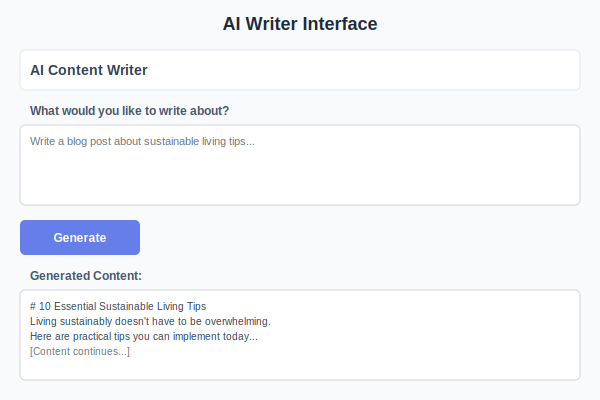

# AI Writing Assistant

The AI Writing Assistant is your creative partner for generating high-quality text content of any kind.

## What Can You Create?

- 📝 **Blog Posts & Articles** - Engaging content for your website or publication
- 📧 **Marketing Copy** - Email campaigns, ads, and promotional content  
- 📄 **Business Documents** - Reports, proposals, and professional communications
- 🎨 **Creative Writing** - Stories, poems, and creative content
- 📱 **Social Media Posts** - Engaging posts for all platforms

## How to Use the AI Writer

### 1. Choose Your Content Type
Select from our pre-built templates or start with a blank document:
- Blog post templates
- Marketing copy formats
- Email templates
- Social media post formats

### 2. Provide Your Prompt
Be specific about what you want:
- **Topic**: What you want to write about
- **Tone**: Professional, casual, humorous, etc.
- **Length**: Word count or approximate length
- **Audience**: Who will read this content

### 3. Generate and Refine
- Click "Generate" to create your content
- Use the "Regenerate" option if you want alternatives
- Edit and customize the output to match your needs

## Best Practices

> **✍️ Writing Effective Prompts**
> 
> - Be specific about your requirements
> - Include context and background information
> - Specify the desired tone and style
> - Mention your target audience
> - Provide examples when helpful

### Example Prompts

**Good**: "Write a 500-word blog post about sustainable gardening tips for beginners. Use a friendly, encouraging tone and include 5 practical tips they can start today."

**Better**: "Write a 500-word blog post for urban millennials about sustainable gardening tips for beginners. Use a friendly, encouraging tone and include 5 practical tips they can start in small apartments today. Focus on low-cost, space-efficient solutions."

## Advanced Features

- **Template Library** - Pre-built formats for common content types
- **Tone Adjustment** - Change the voice and style of your content
- **Length Control** - Specify exact word counts
- **Multiple Versions** - Generate several variations to choose from
- **Content Expansion** - Extend existing content with new sections

## Troubleshooting

**Content too generic?**
- Add more specific details to your prompt
- Include examples of what you're looking for
- Specify your target audience more clearly

**Wrong tone or style?**
- Use the tone selector to adjust the voice
- Include style references in your prompt
- Try regenerating with more specific instructions

**Need more content?**
- Use the "Expand" feature to add more sections
- Ask for specific additional topics to cover
- Generate multiple versions and combine the best parts