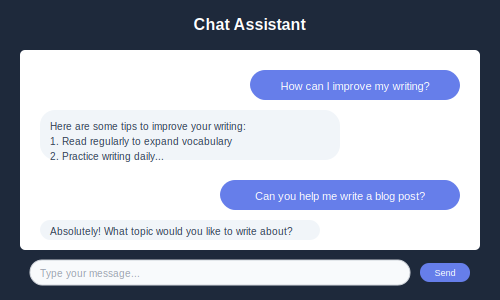

# Chat Assistant

Have intelligent conversations with our AI assistant for brainstorming, problem-solving, and creative collaboration.



## What Can Chat Assistant Help With?

- 💡 **Brainstorming** - Generate ideas and creative solutions
- ❓ **Questions & Answers** - Get instant help and information
- 📝 **Content Planning** - Outline articles, posts, and projects
- 🔍 **Research Assistance** - Gather information on any topic
- 💬 **Creative Writing** - Collaborate on stories and content

## How to Use Chat Assistant

### 1. Start a Conversation
Simply type your question or request in the chat box. Be as specific as possible for the best results.

### 2. Ask Follow-up Questions
The assistant remembers your conversation context, so you can:
- Build on previous responses
- Ask for clarification or more details
- Request different approaches to the same problem

### 3. Use for Different Purposes
- **Quick Questions** - Get fast answers to specific queries
- **Deep Discussions** - Explore complex topics in detail
- **Creative Sessions** - Brainstorm and develop ideas together

## Conversation Tips

> **💬 Getting Better Responses**
>
> - Be specific about what you need
> - Provide context for your questions
> - Ask follow-up questions to dive deeper
> - Let the assistant know if you want a different approach

### Example Conversations

**For Content Creation:**
```
You: "I need to write a blog post about healthy eating"
Assistant: "I'd love to help! What's your target audience, and what specific aspect of healthy eating do you want to focus on?"
You: "It's for busy professionals who want quick, nutritious meal ideas"
Assistant: "Great! Here's an outline for 'Quick & Nutritious Meals for Busy Professionals'..."
```

**For Problem Solving:**
```
You: "I'm struggling to organize my team's workflow"
Assistant: "What specific challenges are you facing with the workflow?"
You: "Too many meetings and unclear task priorities"
Assistant: "Here are some strategies to streamline meetings and improve task prioritization..."
```

## Best Use Cases

### Content Planning
- Outline blog posts and articles
- Develop marketing campaign ideas
- Plan social media content calendars
- Create content strategy frameworks

### Learning & Research
- Explain complex topics in simple terms
- Get summaries of industry trends
- Research competitor strategies
- Learn new skills and techniques

### Creative Projects
- Brainstorm creative concepts
- Develop story ideas and characters
- Explore different creative approaches
- Get feedback on creative work

### Business & Productivity
- Solve workflow problems
- Plan projects and timelines
- Develop business strategies
- Improve team communication

## Advanced Features

**Context Memory**: The assistant remembers your entire conversation, allowing for natural, flowing discussions.

**Multiple Formats**: Ask for responses in different formats:
- Bullet points for quick lists
- Detailed explanations for complex topics
- Step-by-step instructions for processes
- Creative formats for brainstorming

**Tone Flexibility**: The assistant adapts to your preferred communication style:
- Professional for business discussions
- Casual for creative brainstorming
- Educational for learning sessions
- Supportive for problem-solving

## Chat Etiquette

**Be Clear**: Express your needs and expectations clearly

**Stay Focused**: Keep conversations on topic for the best results

**Ask Follow-ups**: Don't hesitate to ask for clarification or additional information

**Provide Feedback**: Let the assistant know if responses meet your needs

## Privacy & Security

- All conversations are private and secure
- Chat history is saved to your account for easy reference
- You can delete conversation history at any time
- No personal information is shared or stored unnecessarily