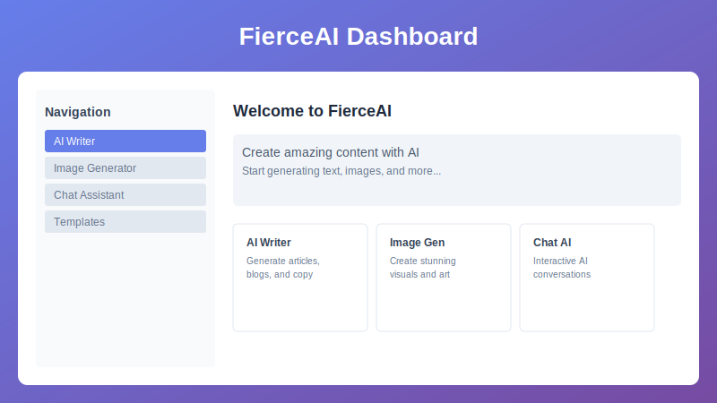

# Quick Start Guide

Get started with FierceAI in just 5 minutes! Follow this step-by-step guide to create your first AI-generated content.

## 1️⃣ Step 1: Access Your Dashboard

After logging in, you'll see your main dashboard with these key areas:

- **Content Creation Tools** - AI Writer, Image Generator, Chat Assistant
- **Recent Projects** - Your latest content and creations
- **Templates** - Pre-built templates for various content types
- **Usage Analytics** - Track your AI usage and credits

## 2️⃣ Step 2: Choose Your Tool

### 🖊️ AI Writer
Perfect for articles, blog posts, marketing copy, and any text content.

### 🎨 Image Generator  
Create stunning visuals, artwork, logos, and graphics.

### 💬 Chat Assistant
Get instant help, brainstorm ideas, or have conversations with AI.

## 3️⃣ Step 3: Create Your First Content

### Using the AI Writer:

1. Click **"AI Writer"** from the main menu
2. Choose a template or start from scratch
3. Enter your topic or prompt
4. Click **"Generate"** and watch the magic happen!
5. Review, edit, and refine your content
6. Save or export when you're satisfied

### Using the Image Generator:

1. Navigate to **"AI Image Generator"**
2. Describe the image you want to create
3. Select style preferences (realistic, artistic, etc.)
4. Click **"Generate Image"**
5. Download your creation

## 4️⃣ Step 4: Save and Manage

- All your content is automatically saved to your account
- Access previous generations from the **"My Content"** section
- Organize your work with folders and tags

## 👞 Next Steps

✅ **Explore Templates** - Browse our template library for inspiration

✅ **Check Your Usage** - Monitor your credits and plan limits

✅ **Join the Community** - Connect with other FierceAI users

## ❔ Need Help?

If you get stuck, check out:
- [❓ FAQ](../support/faq.md)
- [🔧 Troubleshooting](../troubleshooting/common-issues.md)
- [📞 Contact Support](../support/contact.md)

**Congratulations! You're now ready to create amazing content with FierceAI! 🎉**